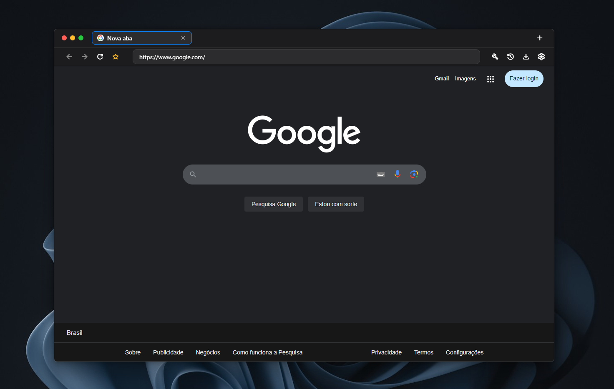
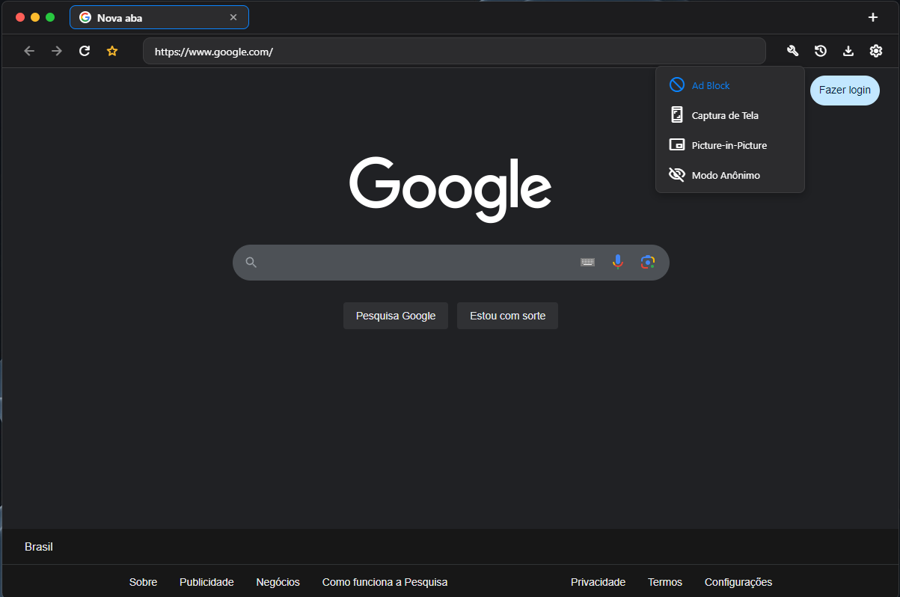

# 🌐 Clean Browser

A lightweight, fast web browser focused on being simple and beautiful, built with Electron.

<p align="center">
  
</p>

## ✨ **Key Features**

### 🎨 **Design**
- Minimalist and modern interface
- Themes: **Light, Dark, and Purple**
- Intuitive tab system
- Simplified navigation bar

### 🛠️ **Functionality**
- Tabbed browsing
- Incognito mode
- Ad blocker
- Screenshots
- Picture-in-Picture
- Favorites and history
- Integrated download manager

### 🔒 **Privacy & Security**
- Anonymous browsing
- Tracker blocking
- Automatic data cleanup upon closing

### ⚡ **Performance**
- Resource optimization
- Fast loading
- **Hardware acceleration** for better performance

## 🚀 **Technologies**
- Electron
- JavaScript
- HTML/CSS
- Node.js

## 💻 **Installation**

1. Clone the repository:
   ```bash
   git clone https://github.com/lucasvitancourt/clean-browser.git
   ```

2. Install dependencies:
   ```bash
   cd clean-browser
   npm install
   ```

3. Run in development mode:
   ```bash
   npm run dev
   ```
  
